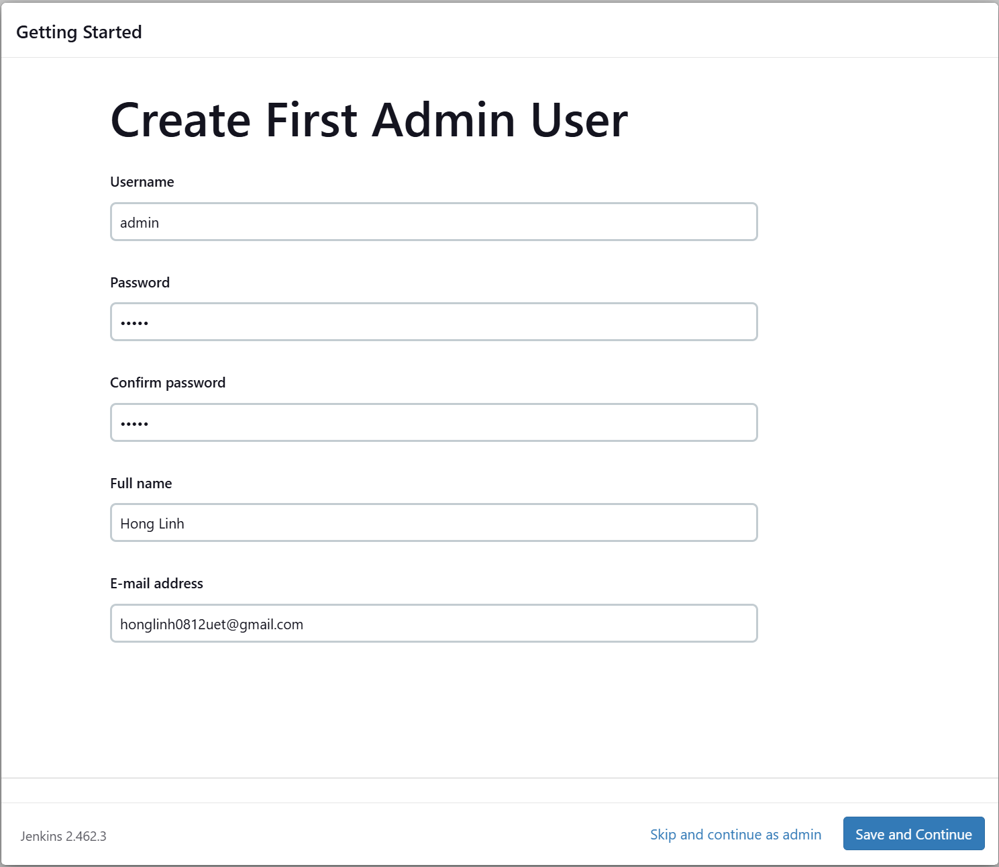
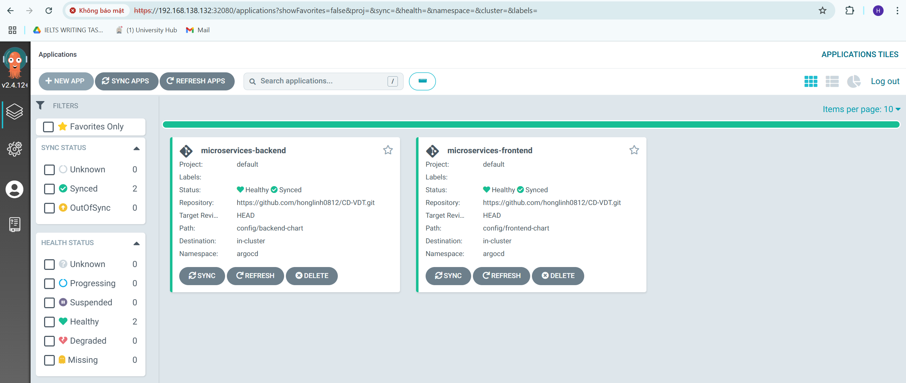
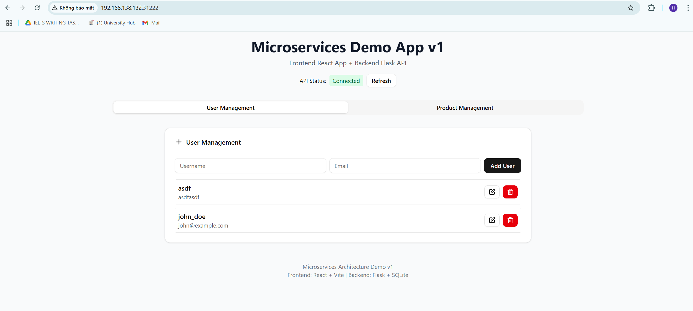
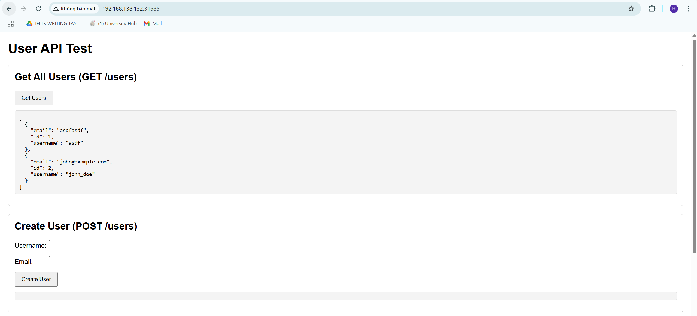
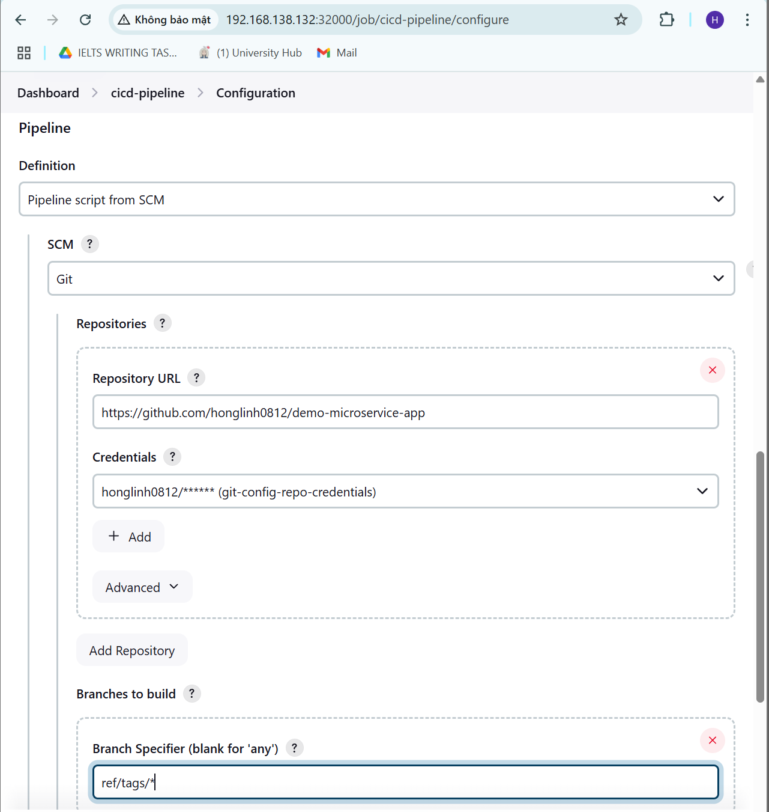
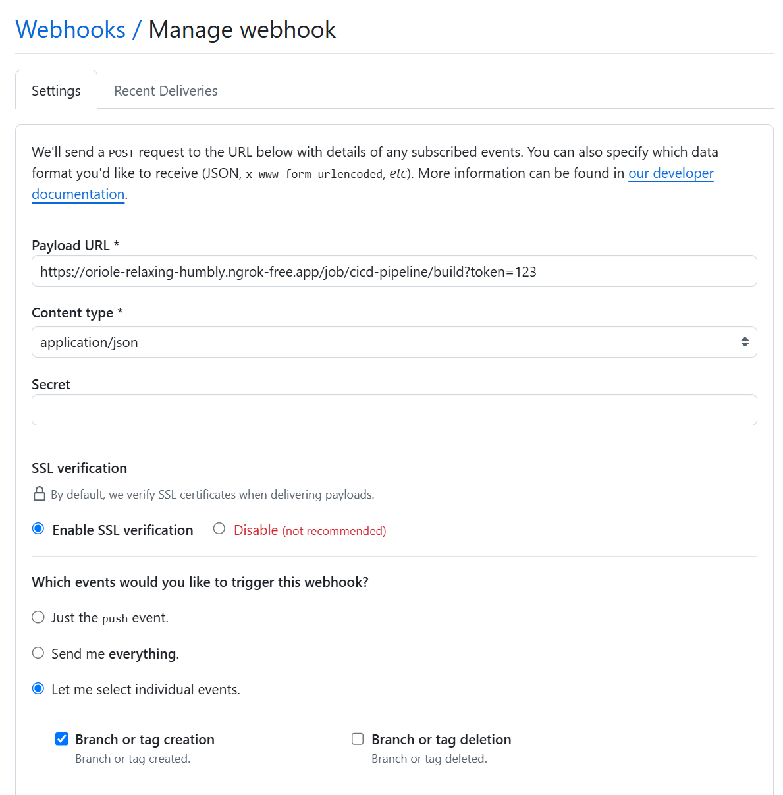
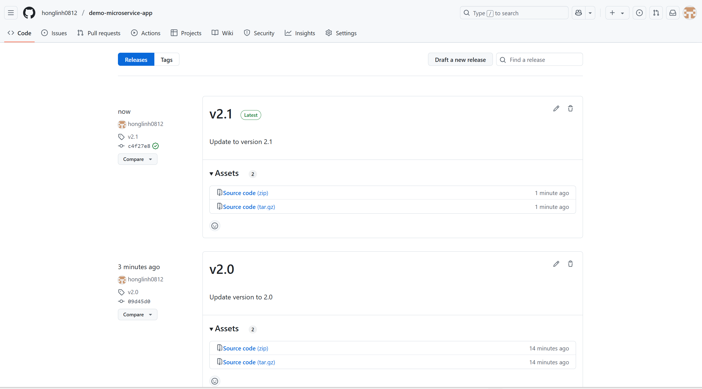
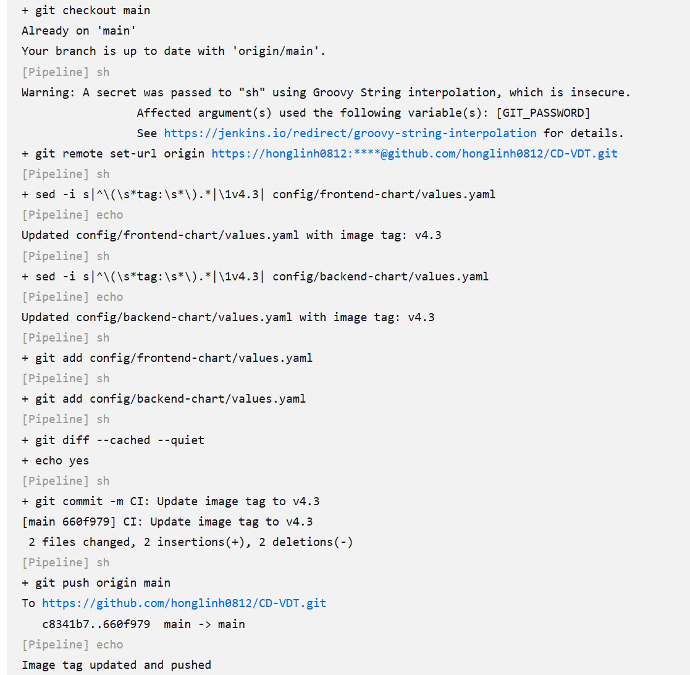
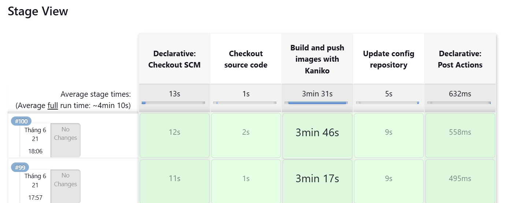
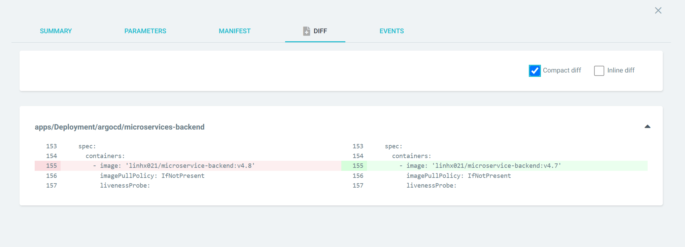

Bài tập cuối kì Giai đoạn 1 - VDT2025

Người thực hiện: Nguyễn Hồng Lĩnh
Ngày hoàn thành: 22/06/2025

## 1. Triển khai Kubernetes
- Đề bài: Triển khai được Kubernetes thông qua công cụ kubeadm hoặc kubespray lên 1 master node VM + 1 worker node VM
- Lời giải:

Chi tiết cách cài đặt Kubernetes bằng Kubespray:
Công cụ cần thiết:
- Yêu cầu máy

| Máy      |                Vai trò                              | RAM    | Lưu ý       |
| -------- | ----------------------------------------------------|--------|-------------|
| ansible  | Node control, có cài đặt ansible, docker, kubespray |  1GB   |Đổi port SSH |
| master1  | master + etcd                                       |  3GB   |Đổi port SSH |
| worker1  | worker                                              |  4GB   |Đổi port SSH |

Tất cả dùng Ubuntu (khuyến nghị 20.04+), đã cấu hình SSH thông từ Ansible sang master1 và worker1.

Script cài đặt Docker:

Cài đặt Ansible bằng lệnh: sudo apt install ansible-core
- Tại máy Ansible
Clone và chạy container Kubespray:
git clone https://github.com/kubernetes-sigs/kubespray
cd kubespray

Trước khi chạy container, tạo key SSH và để vào đường dẫn mặc định .ssh/id_rsa
ssh-keygen -t rsa

Sau đó thực hiện chạy container:
docker run --rm -it \
  --mount type=bind,source="$(pwd)"/inventory/sample,dst=/inventory \
  --mount type=bind,source="${HOME}"/.ssh/id_rsa,dst=/root/.ssh/id_rsa \
  quay.io/kubespray/kubespray:v2.28.0 bash
- Tạo file inventory:
Vào trong container, sửa nội dung file /inventory/inventory.ini như sau:

[kube_control_plane]
master1 ansible_host=<ip_master> ansible_port=<port_ssh_sang_master1> ansible_user=<user_có_quyền_lên_root> #viết liền 1 dòng

[etcd:children]
kube_control_plane

[kube_node]
worker1 ansible_host=<ip_worker> ansible_port=<port_ssh_sang_worker1> ansible_user=<user_có_quyền_lên_root>

[k8s_cluster:children]
kube_control_plane
kube_node

- Chạy cài đặt K8s:
ansible-playbook -i /kubespray/inventory/inventory.ini cluster.yml --become --ask-pass --ask-become-pass
- Nhập mật khẩu SSH + mật khẩu sudo.
- Nếu không có node nào failed, là thành công.

- Cài kubectl (trên Ansible hoặc worker1):
Link: https://kubernetes.io/docs/tasks/tools/install-kubectl-linux/
curl -LO "https://dl.k8s.io/release/$(curl -sL https://dl.k8s.io/release/stable.txt)/bin/linux/amd64/kubectl"
sudo install -o root -g root -m 0755 kubectl /usr/local/bin/kubectl
- Cấu hình kubeconfig:
Trên master1:
sudo cat /etc/kubernetes/admin.conf
Copy file kubeconfig về máy Ansible, sửa phần ip của API Server, lưu vào file, ví dụ k8s-config.yaml:
server: https://127.0.0.1:6443 sửa thành => https://192.168.138.132:6443, rồi gán env variable KUBECONFIG:

Mở file ~/.bashrc, lưu dòng dưới vào:
export KUBECONFIG=/home/linhnh/k8s-config.yaml
Sau đó chạy lệnh source /home/linhnh/.bashrc để áp dụng.

Kiểm tra trạng thái cụm và các pods bằng các lệnh:
kubectl get nodes -o wide
kubectl get pods -A -o wide
Thấy Node ở trạng thái Ready, Pod ở trạng thái Running là hoàn tất.

## 2. Triển khai web application sử dụng các DevOps tools & practices

K8S Helm Chart
- Cài đặt ArgoCD lên K8s cluster, expose ArgoCD service qua NodePort
Nội dung file cài đặt ArgoCD có tại /scripts/manifests/argocd-install.yaml.

Để cài đặt, chạy lệnh kubectl apply -f argocd.yaml
Truy cập ArgoCD:
Truy cập tại: https://<NodeIP>:32080
Tài khoản mặc định là admin, mật khẩu mặc định là kết quả của lệnh sau:
kubectl -n argocd get secret argocd-initial-admin-secret -o jsonpath="{.data.password}" | base64 -d && echo

- Cài đặt Jenkins lên K8s cluster, expose Jenkins service qua NodePort
Nội dung file cài đặt Jenkins có tại /scripts/manifests/jenkins-install.yaml

Thực hiện tạo Jenkins instance bằng việc chạy lệnh kubectl apply -f jenkins.yaml

Truy cập Jenkins tại http://<NodeIP>:32000
Đăng nhập với tài khoản mặc định là admin, mật khẩu là kết quả của lệnh
kubectl exec -n jenkins -it $(kubectl get pod -n jenkins -l app=jenkins -o jsonpath="{.items[0].metadata.name}") -- \
  cat /var/jenkins_home/secrets/initialAdminPassword

Sau khi nhập mật khẩu, chọn Install suggested plugins, đợi Jenkins cài đặt hoàn tất.

Sau đó nhập các thông tin người dùng để sử dụng Jenkins.

Nhập thông tin xong, cài đặt đã hoàn tất.

- Viết hoặc tìm mẫu Helm Chart cho app bất kỳ, để vào 1 folder riêng trong repo app

Mẫu Helm Chart đã được lấy về tại repo demo-microservices-app: https://github.com/honglinh0812/demo-microservice-app
- Tạo Repo Config cho app trên, trong repo này chứa các file values.yaml với nội dung của cá file values.yaml là các config cần thiết để chạy ứng dụng trên k8s bằng Helm Chart

Các file trong Repo config được sắp xếp như sau:
└── config
    ├── backend-chart
    │   └── values.yaml
    └── frontend-chart
        └── values.yaml

Manifest của ArgoCD Application

2 file Manifest riêng cho backend và frontend có tại scripts/manifests/argocd-backend.yaml và scripts/manifests/argocd-frontend.yaml

Đây là ảnh chụp giao diện màn hình hệ thống ArgoCD trên trình duyệt:

Ảnh chụp giao diện màn hình trình duyệt khi truy cập vào Web URL, API URL

## 3. CI/CD (1.5đ)
Yêu cầu:
- Viết 1 luồng CI/CD cho app, khi có thay đổi từ source code, 1 tag mới được tạo ra trên trên repo này thì luồng CI/CD tương ứng của repo đó thực hiện các công việc sau:
- Sửa code trong source code
- Thực hiện build source code trên jenkin bằng docker với image tag là tag name đã được tạo ra trên gitlab/github và push docker image sau khi build xong lên Docker Hub
- Sửa giá trị Image version trong file values.yaml  trong config repo và push thay đổi lên config repo.
- Cấu hình ArgoCD tự động triển khai lại web Deployment và api Deployment khi có sự thay đổi trên config repo.

Thực hiện:
- Các file setup công cụ của luồng CI/CD
Ta thực hiện build frontend, backend image của app đưa lên repo dockerhub.

Sau đó, ta apply các application argoCD để theo dõi các file values trên config repo để bắt các thay đổi từ các file này áp dụng vào trong web service, api service đang được deploy trong k8s.

Cấu hình Jenkins để chạy pipeline:
- Tải các plugin cần thiết: Github Integration, Kubernetes, Pipeline View Stage
- Cấu hình các dữ liệu dùng để đăng nhập trong Manage Jenkins / Credentials.
  Username, password để đăng nhập vào Git config repo.
  Username, password để đăng nhập Docker Hub.

- Cấu hình Cloud để kết nối với cụm Kubernetes
- Viết pipeline để thực hiện các công việc: Checkout Git, build và push image với tag mới nếu thấy có tag mới, chỉnh sửa giá trị các biến tag trong các file values.yaml.
Pipeline được đưa lên source code repo: https://github.com/honglinh0812/demo-microservice-app

Pipeline configuration như sau:

- Cấu hình webhook để trigger Jenkins khi tạo tag mới trên GitHub:
Trước hết ở Jenkins, trong phần 'Configure pipeline', tích chọn Trigger builds remotely
Token có thể điền bất kỳ.
Sau đó tại GitHub, trong phần source code repo, chọn mục Settings - Webhooks, điền URL của webhook theo hướng dẫn dưới mục Trigger builds remotely, chọn loại thông tin, chọn sự kiện cho webhook.

- Output log của luồng CI/CD khi tạo tag mới trên repo app:

- Ảnh luồng CI/CD chạy qua các stage trên giao diện Jenkins ( sử dụng Plugin Pipeline Stage View)

- Hình ảnh app triển khai argoCD, hình ảnh diff khi argoCD phát hiện thay đổi ở config repo như sau:

## 4. Monitoring
- Expose metric của app ra 1 http path.

Trước hết cần cài đặt package: pip install prometheus-flask-exporter
Sau đó, tạo path /metrics như sau:

- Sử dụng ansible playbooks để triển khai container Prometheus server. Sau đó cấu hình prometheus add target giám sát các metrics đã expose ở trên.

Cấu trúc ansible playbook như sau:

├── hosts
└── prometheus
    ├── files
    │   └── prometheus.yml
    └── prometheus-playbook.yml

File prometheus.yml chịu trách nhiệm cấu hình job với endpoint metrics cụ thể

Nội dung playbook có tại scripts/ansible-scripts/monitoring/prometheus-playbook.yml.

Để chạy playbook, chạy lệnh ansible-playbook -i hosts prometheus/prometheus-playbook.yml --ask-pass --ask-become-pass. Nhập pass SSH và pass sudo.

Kết quả sau khi chạy playbook:

UI Prometheus khi truy cập:

Các metrics xuất hiện trên prometheus:

## 5. Logging

Yêu cầu:
- Sử dụng ansible playbooks để triển khai stack EFK (elasticsearch, fluentd, kibana), sau đó cấu hình logging cho web service và api service, đảm bảo khi có http request gửi vào web service hoặc api service thì trong các log mà các service này sinh ra, có ít nhất 1 log có các thông tin:
- Request Path(VD: /api1/1, /api2/3 ..)
- HTTP Method VD: (GET PUT POST…)
- Response Code: 302, 200, 202, 201…

Thực hiện:
Cài đặt EFK stack bằng ansible
Cấu trúc thư mục cài đặt như sau:

├── elasticsearch
│   └── elasticsearch.yml
├── fluentd
│   ├── fluentd-configmap.yml
│   └── fluentd-daemonset.yml
├── inventory.ini
└── kibana
    └── kibana.yml

fluentd.conf là cấu hình cho Fluentd để thu thập logs và gửi đến Elasticsearch. Ta có thể điều chỉnh phần source để phù hợp với cách ứng dụng ghi log

Riêng fluentd cài trực tiếp vào cụm do cần lấy logs của các node trong cụm. Ta sử dụng Daemon set vì cần đảm bảo mỗi node có đúng 1 pod fluentd chịu trách nhiệm thu thập logs.

Các file playbook cài đặt có tại /scripts/ansible-scripts/logging. Các file này đều chạy các service tương ứng trên container.

Để chạy playbook, chạy lệnh ansible-playbook -i inventory.ini 'filename'.yml --ask-pass --ask-become-pass. Nhập pass SSH và pass sudo.

Kết quả truy cập khi cài đặt thành công 3 service, giao diện kibana như sau:

## 6. Security

Yêu cầu 1:
- Dựng HAProxy Loadbalancer trên 1 VM riêng với mode TCP, mở port trên LB trỏ đến NodePort của App trên K8S Cluster. 
- Sử dụng giải pháp Ingress cho các deployment, đảm bảo các truy cập đến các port App sử dụng https 

Để dựng HAProxy load balancer, ta dựng cấu hình file haproxy.cfg để cấu hình chco load balancer dẫn request vào app.

Thực hiện:

File cấu hình của HAProxy Loadbalancer cho App nằm trong mục scripts/security/haproxy/haproxy.cfg

Viết playbook cài đặt haproxy và inventory sau đó chạy lệnh
ansible-playbook -i inventory.ini haproxy.yml --ask-pass --ask-become-pass

Để cấu hình ingress cho các deployment, thực hiện như sau:
- Tạo cert bằng openssl:
openssl req -x509 -nodes -days 365 -newkey rsa:2048   -keyout tls.key   -out tls.crt   -subj "/CN=linhx.test/O=MyOrg"   -addext "subjectAltName=DNS:linhx.test"
- Tạo ingress, trong đó chú ý:
- Cần phải chứa dòng ingressClassName: nginx trong mục spec.
- Namespace của ingress phải trùng với namespace của service mà ingress trỏ đến.
- Chú ý port của service trong mục rules.host.http.paths.backend cần trùng với service ingress đang trỏ đến.

File cấu hình ingress: scripts/security/ingress.yaml
- Tạo ingress controller
- Cài đặt bằng lệnh kubectl apply -f https://raw.githubusercontent.com/kubernetes/ingress-nginx/controller-v1.10.1/deploy/static/provider/cloud/deploy.yaml

Sau khi cấu hình đầy đủ, app đã có thể được truy cập bằng HTTPS.

Kiểm tra ingress phải thấy các mục đều có đủ thông tin.

Kết quả truy cập vào App từ trình duyệt thông qua giao thức https hoặc dùng curl

Yêu cầu 2:
- Đảm bảo 1 số URL của api service  khi truy cập phải có xác thực thông qua 1 trong số các phương thức cookie, basic auth, token auth, nếu không sẽ trả về HTTP response code 403.
- File trình bày giải pháp sử dụng để authen/authorization cho các service

https://docs.google.com/document/d/1POfFg36iXzFpvIoJqTi9p0kEH5P1_2P3dqJ4u__B3X8/edit?usp=sharing

Hiện trong backend đã cấu hình URL mẫu /api/secure-data yêu cầu xác thực bằng basic auth. Nếu request không bao gồm thông tin xác thực (username + password), response trả về có thể cấu hình là 403.

Chỉ khi người dùng gửi kèm thông tin xác thực, response mới trả về 200.

- Thực hiện phân quyền cho 2 loại người dùng trên API:
- Nếu người dùng có role là user thì truy cập vào GET request trả về code 200, còn truy cập vào POST/DELETE thì trả về 403
- Nếu người dùng có role là admin thì truy cập vào GET request trả về code 200, còn truy cập vào POST/DELETE thì trả về 2xx

Endpoint phân quyền được cấu hình trong API service như sau:
+ `POST /api/admin-only` và `DELETE /api/admin-only`
Chỉ `admin1` mới có thể truy cập (trả về 200).

Nếu `user1` gửi POST/DELETE request sẽ nhận phản hồi là 403.

+ `GET /api/user-get`:
`user1` và `admin1` đều có thể truy cập (trả về 200).

+ `POST /api/user-post-delete` và `DELETE /api/user-post-delete`:
`user1` sẽ nhận 403 khi truy cập POST/DELETE.

Yêu cầu 3:

Sử dụng 1 trong số các giải pháp để ratelimit cho Endpoint của api Service, sao cho nếu có  quá 10 request trong 1 phút gửi đến Endpoint của api service thì các request sau đó bị trả về HTTP Response 409

Tài liệu trình bày giải pháp về rate limit cho endpoint của API service: https://docs.google.com/document/d/1H7I6eE4CKSyHrjNDJtuBcF2nLvXf6s8vy_dFITufmwk/edit?usp=sharing
- File ghi lại kết quả thử nghiệm khi gọi quá 10 request trong 1 phút vào Endpoint của API Service.

Sử dụng bash script để tạo nhanh số request tới endpoint /api/products của API service:

Kết quả khi chạy:

